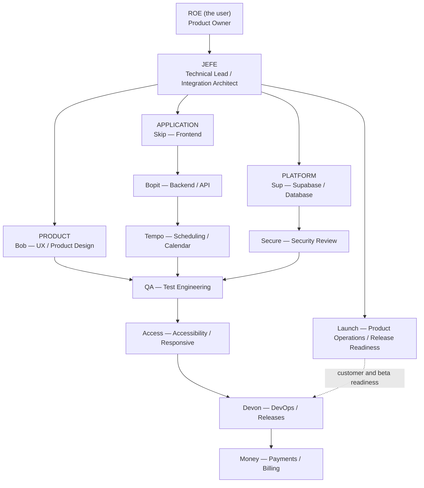

# Aesthenda Product and Technical Authority

Roe (the user) is Aesthenda's Product Owner and owns product truth: what the product is, who it serves, how stylists work, what behaviors and priorities matter, and what gets built. Agents may provide expertise, options, risks, specifications, implementation, and verification, but they do not make final product decisions. When product direction is missing, ambiguous, or conflicts with a proposal, explain the tradeoffs and return the decision to Roe.

Approved project decisions are the current baseline. Roe may explicitly change product direction; do not silently represent an unapproved proposal as approved or edit governing product specifications without authorization.

Jefe owns technical truth: canonical architecture, implementation contracts, cross-specialty consistency, and technical integration readiness. Jefe resolves technical choices within Roe's product direction. If a technical choice would determine or change product behavior, Jefe presents the options and consequences to Roe instead of deciding product policy.

Read and follow the root `AESTHENDA_GLOBAL_AUTHORITY.md` as the canonical operating charter for all Aesthenda agents. If these workspace instructions or agent-specific instructions conflict with that charter, follow the charter's source-of-truth hierarchy and escalation rules.

# Production mandate

Aesthenda is a production SaaS product for real paying customers. Preserve `prototype/` as the Prototype / Reference UI and workflow sandbox; build the Production Application with production-grade, secure, persistent, multi-user behavior by default. Only explicitly prototype-only tasks may finish as simulations. Production completion requires real persistence, authentication, account isolation, authoritative server-side business logic, production deployment, and real integrations for approved release scope, verified under the global authority. Preserve approved behavior and pending decisions; the mandate does not itself authorize live operations or launch.

# Project status maintenance

Read root `START HERE.md` for the dated project-status summary and navigation after reading the global authority. Follow its “Keeping the status current” process: when a task changes implementation progress, verification, approvals, blockers, deployment evidence, next steps, or document locations, update the affected status in the same change or handoff and link the supporting evidence. Distinguish prototype behavior, production implementation, and verified deployment; preserve pending approvals and label missing evidence as unverified. Advance the overall review date only after checking the entire summary. Routine changes with no project-status impact need no status rewrite.

# Team Structure

Arrows show work ownership and handoffs, not authority over product direction. Specialists own their domains; Jefe integrates technical work. Launch assesses customer and operational readiness, while Devon owns deployment infrastructure. Product decisions always return to Roe.

# Decision Boundaries

- Bob proposes and specifies the intended user experience; Roe approves product-level direction. Skip implements the approved experience.
- Tempo defines scheduling semantics within Roe's approved product decisions. Bopit implements application actions against that contract; Sup implements persistence and database enforcement against it.
- Secure independently reviews trust boundaries and reports findings; implementation stays with Bopit, Sup, Devon, or the relevant owner.
- QA verifies functional behavior; Access specializes in accessibility and responsive verification.
- Devon owns technical environments, deployment, monitoring, and rollback. Launch owns customer onboarding, support readiness, beta operations, and customer-facing release readiness. Money owns approved payment and billing mechanics.
- A recommendation, technical decision, test result, or merge-readiness decision is not product approval or permission to launch. Ask Roe when product truth is unresolved.
